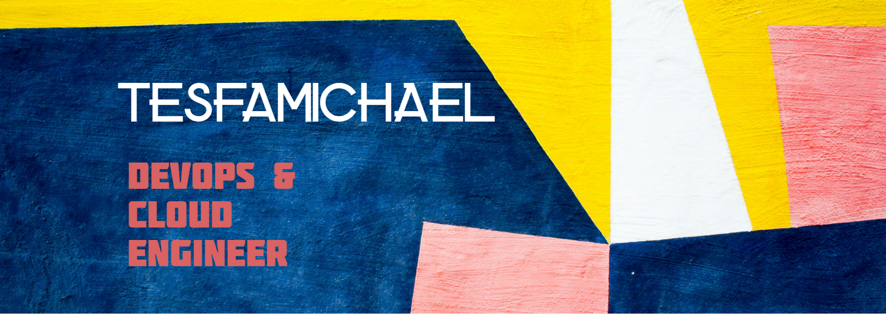

# Hey there! 👋 I'm Tesfamichael Aboset

## 🚀 DevOps Engineer | Cloud | Automation | Kubernetes | CI/CD

I'm a passionate DevOps Engineer on a mission to **automate everything** and **scale cloud infrastructures efficiently**. If it's manual, I'll script it. If it's slow, I'll optimize it. If it's complex, I'll simplify it! 😎

### 🌟 What I Do
- **Cloud & DevOps Wizardry** – Designing scalable, secure, and high-performance infrastructures with **AWS, Azure, Kubernetes, Terraform**, and more! ☁️🚀
- **Automation Addict** – Building **CI/CD pipelines, Infrastructure as Code (IaC)**, and streamlining deployments like magic. ✨
- **Tech Storyteller** – I write blogs, build projects, and share knowledge because DevOps is more fun when we grow together! 📢💡

### 🛠️ Tech Tools I Love
- **Cloud:** AWS | Azure | GCP
- **Containers & Orchestration:** Docker | Kubernetes | Helm | Istio
- **CI/CD & Automation:** GitHub Actions | GitLab CI/CD | Jenkins | ArgoCD | Terraform | Ansible
- **Monitoring & Security:** Prometheus | Grafana | Loki | SonarQube | Teleport
- **Scripting & Programming:** Bash | Python | Golang

### 📬 Let's Connect
- 🚀 [LinkedIn](https://linkedin.com/in/tesfamichael-aboset)
- 📖 [My Blog](#) (Coming soon... stay tuned!)
- 🐦 [Twitter](https://twitter.com/yourhandle)

---
💡 "Infrastructure should be **immutable**, pipelines should be **reliable**, and engineers should be **well-caffeinated** ☕!"

